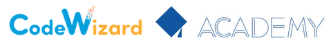

<div style="text-align: center">



<!--
&emsp;[](https://www.linkedin.com/in/nirgeier/)
-->

&emsp;[](mailto:nirg@codewizard.co.il)&emsp;[](https://api.whatsapp.com/send/?phone=972548122310&text=%D7%A9%D7%9C%D7%95%D7%9D.%20%D7%90%D7%A0%D7%99%20%D7%9E%D7%AA%D7%A2%D7%A0%D7%99%D7%99%D7%9F%20%D7%91%D7%A7%D7%95%D7%A8%D7%A1%D7%99%D7%9D)

&emsp;[](mailto:yanir.levi@codewizard.co.il)

</div>

---

### Kubernetes

| Level        | Duration    |
| ------------ | ----------- |
| Introduction | 24-32 hours |

---

## Content

### Python 24-32 Hours

```bash
- Setup python
- Python Basics
  - Syntax
  - Variables
  - Variables & Data structures
  - Global variables
  - Numbers integer/float
  - Strings
  - User input
  - List
  - Range
  - Tuples
  - Dictionaries
  - Sets

- Iterators / Enumerable
- Flow control
  - If/else
  - For
  - While
  - Pass / continue / break
  - try / except

- Functions
- Def
- Default arguments
- Modules / Packages

- Classes
  - Getters  / Setters
  - Inheritance
  - Subclasses
  - Data attributes & properties

- Input & output
  - Files

- Micro-framework
  - Flask (web server)

- Generators / Decorators
  - Next
  - Range
  - Yield
  - Map

- Streams: Sync / Async
- Pip

###
### Live Demos
###
- Many Live Demo(s)

```

---

© CodeWizard LTD
